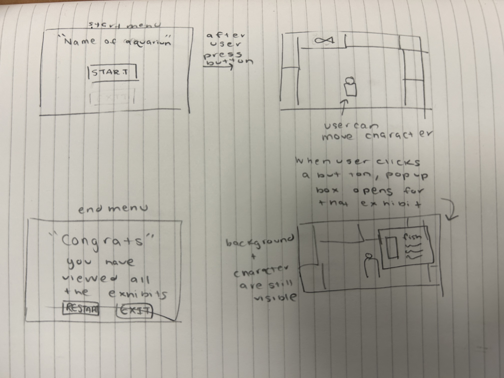
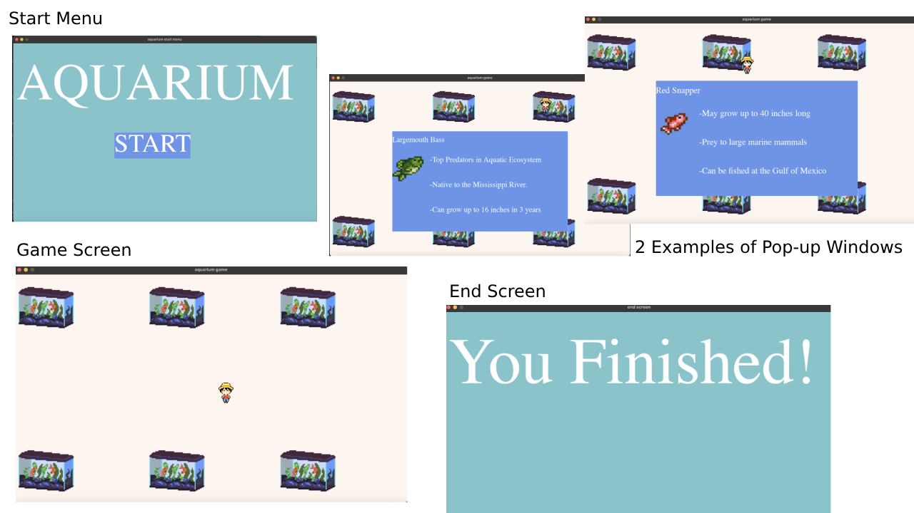

:warning: Everything between << >> needs to be replaced (remove << >> after replacing)

# Aquarium Tour 
## CS110 Final Project  Fall, 2023

## Team Members

Megan Eng, Mingyang Liu

***

## Project Description

Our game simulates a visual tour of an Aquarium in which the user can control the character by hitting the up, down, left, and right arrow keys to interact with different exhibits. In order to "finish" the game, all exhibits must have been viewed.

***    

## GUI Design
### Initial Design

### Final Design

## Program Design
### Features

1. Start Menu 
2. User-Controlled character
3. Character Collision with Objects
4. Pop up screens with information
5. End Screen

### Classes

Player 
 A character that the user can move by clicking on the up, down, left, and right keyboard keys

Timer 
 A timer used in the backend to determine how far the player moves

FishTank 
 A rectangle that the user can collide with to recieve a pop-up window with more information about the exhibit

Button 
 A rectangle that prompts a new event to occur when 

InfoBox 
 A popup window that displays the exhibit information and image

## ATP

Test Case 1: Menu Navigation
    Description: Test the navigation through the game's main menu.
    Test Steps:
        1. Start the game.
        2. Click on the Start Button.
    Expected Outcome: The screen should initially display the menu screen but will switch to the game screen after clicking on the start button.

Test Case 2: Player Movement
    Description: Verify that the player can move up, down, left, and right.
    Test Steps:
        1. Start the game.
        2. Click on the Start Button.
        3. Press the left arrow key 1-2 times.
        4. Verify that the player moves left.
        5.Press the right arrow key 1-2 times.
        6.Verify that the player moves right.
        7.Press the up arrow key 1-2 times.
        8.Verify that the player moves up.
        9.Press the down arrow key 1-2 times.
        10.Verify that the player moves down.
    Expected Outcome: The player should move left, right, up, and down in response to the arrow key inputs.

Test Case 3: Collision Detection
    Test Description: Ensure that the player can collide with fishtanks without going off the screen.
    Test Steps:
        1. Start the game.
        2. Click on the Start Button.
        3. Freely move the character with the arrow keys so that it is makes contact with each fish tank.
    Expected Outcome: The Player should be able to touch each fish tank without going off the screen.

Test Case 4: Pop Up Window 
    Description: Ensure that when the player collides with a fishtank, a information box about the exhibit is displayed.
    Test Steps:
        1. 1. Start the game.
        2. Click on the Start Button.
        3. Move the character with the arrow keys so that it is touching the fish tank and a "pop up window" will appear.
        4. Move the character with the arrow keys so that it is not touching the fish tank to have the "pop up window" disappear.
        5. Repeat steps 3-4 for all fish tanks.
    Expected Outcome: A Pop up Window should open and give information about the exhibit. The player colliding with the top left tank should not display the same information as when the player collides with the bottom right tank. Each tank corresponds to a different exhibit and there are 6 different exhibits.

Test Case 5: Game Over Condition
    Test Description: Confirm that the game ends when the player has viewed all fish tanks.
    Test Steps:
        1. Start the game.
        2. Click on the Start Button.
        3. Move the character with the arrow keys so that it is touching the fish tank.
        4. Move the character with the arrow keys so that it is not touching the fish tank to have the "pop up window" disappear.
        5. Repeat steps 3-4 for all fish tanks.
        6. Verify that the game displays a "You Finished!" message.
    Expected Outcome: The game should display a "You Finished!" message when the player has viewed all aquarium exhibits.

